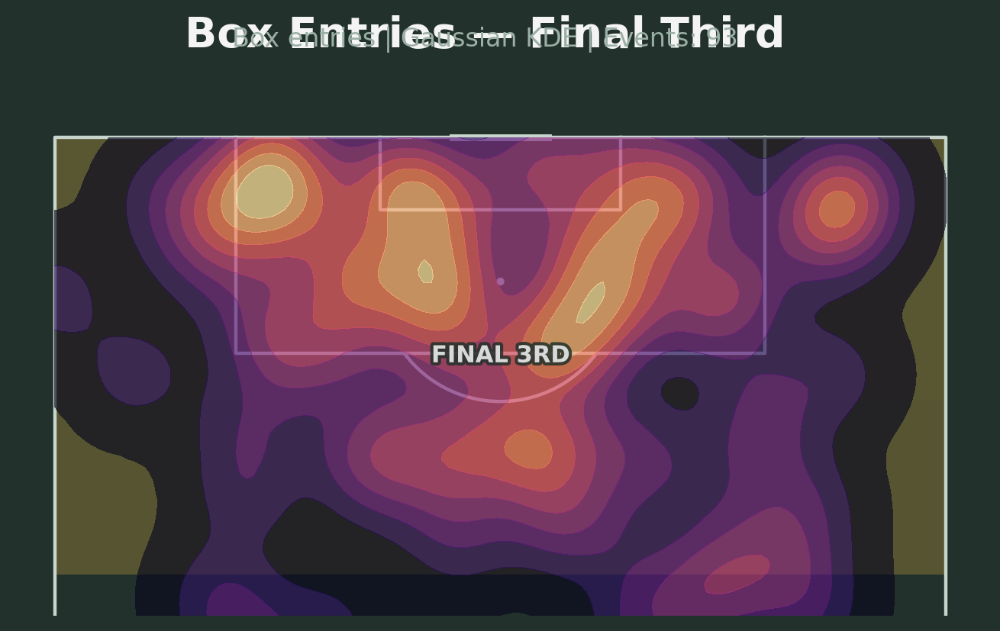
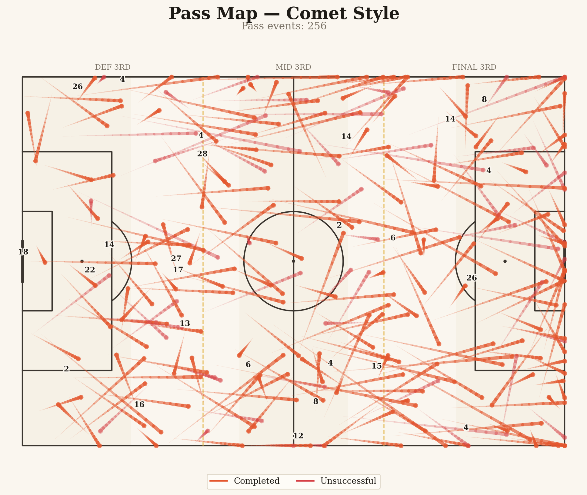
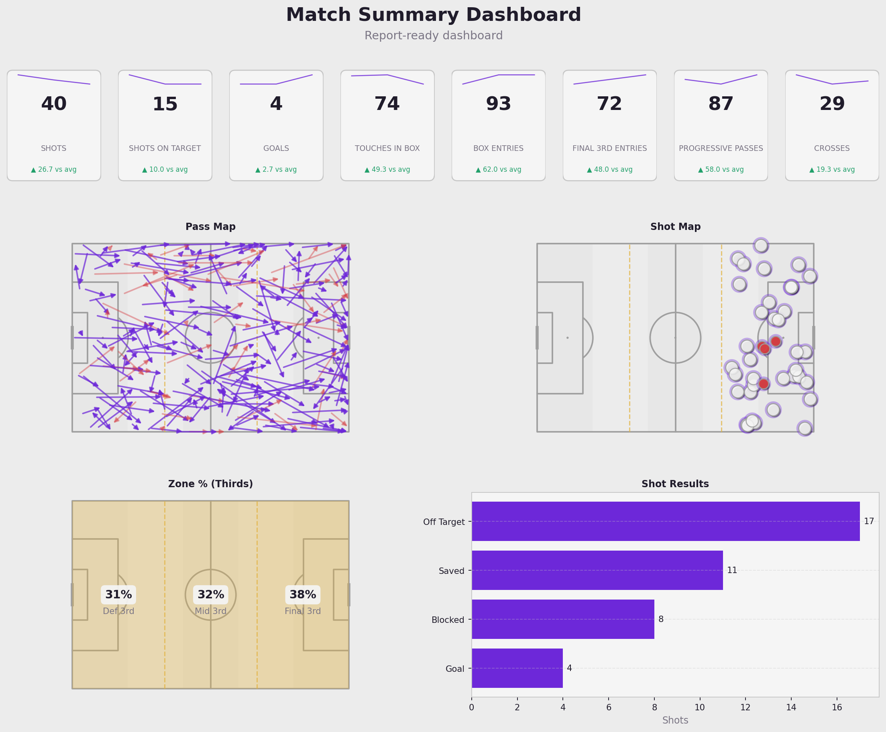

# Opposition Charts App

Opponent open-play analysis for professional first-team use. Streamlit + Pandas + Matplotlib + mplsoccer. No set-pieces, no xG model required.

**v4 — Production Visualization Engine** (Phase 7): plugin registry, pitch engine (9 views, horizontal/vertical/auto, mirror/flip), thirds engine (10 modes), 16 visualization themes (figure-only), heatmap studio (9 types × 10 presets), marker/arrow studios, collision-aware label engine, legend engine, Athletic-style stat tables, match summary cards, 8 preset dashboards + custom dashboard with JSON templates, PNG/SVG/PDF export matching preview.

## Run locally
```bash
pip install -r requirements.txt
streamlit run app.py
```

## Deploy — Streamlit Community Cloud
Point the app at `app.py` in the repo root. `requirements.txt` is complete; no extra config needed.

## Data
Upload CSV/Excel. Minimum columns: `event_type, x, y` (0–100 or 120×80 coordinates).
Recommended: `team, opponent, match_id, phase, player, receiver, x2, y2, outcome, shot_result, body_part, minute, second, period, sequence_id`.
A demo dataset is included at `data/sample_open_play_data.csv`.

## Tests
```bash
FAP_TEST=1 python tests/test_phase7.py
```
Renders every registered plugin across orientations, views, thirds modes, heat types, arrow styles, marker shapes, themes and export formats. Current status: **160 passed / 0 failed**.

## Sample output
| | | |
|---|---|---|
|  |  |  |

Engine details and the Phase 7 change log: [`docs/PHASE7_NOTES.md`](docs/PHASE7_NOTES.md).
